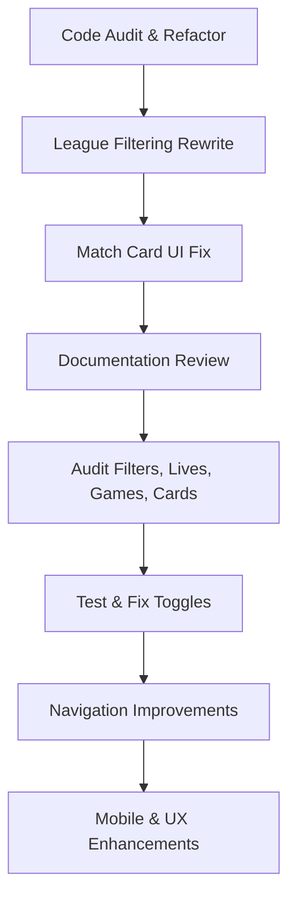

# PandaScore Tracker Plugin: Audit & Roadmap Checklist

## Current Status (as of 2025-09-25)

### ✅ Completed
- Codebase refactored to component-based architecture
- League filtering feature fully rewritten (toggleable, local images, improved UX)
- Match card UI fixed and CSS consolidated
- Backward compatibility maintained

### 🟡 In Progress
- Documentation review for working/incomplete features

### ⏳ Next Steps
- Audit and improve filters, live, games, cards, and details features
- Ensure navigation from cards to detail pages works
- Test and fix all toggles for card content display

---

## Feature Implementation Status

| Feature                | Status      | Notes |
|------------------------|------------|-------|
| Component Refactor     | Complete   | Modular, maintainable |
| League Filtering       | Complete   | Toggleable, local images |
| Match Card UI          | Complete   | Card-based, CSS fixed |
| Live Updates           | Complete | WebSocket & polling logic modular |
| Upcoming Matches       | Complete | Clean separation from live |
| Card Navigation        | Complete | Click-to-detail navigation implemented |
| Toggle Functionality   | Needs Testing | State management in JS, needs UX validation |
| Mobile Responsiveness  | Potential Improvement | Not fully tested |

---

## Visual Roadmap (Mermaid)

---

## User Journey (Summary)
1. User lands on main tracker page
2. User sees league filter buttons (toggleable)
3. User clicks a filter, matches update instantly
4. User clicks a match card, expects navigation to detail page
5. User toggles between live/upcoming, expects correct content
6. User experiences consistent, responsive UI

---

## Next Steps (Actionable)
- [ ] Test all toggles for correct state/content
- [ ] Validate mobile responsiveness
- [ ] Document any incomplete or improvable features
